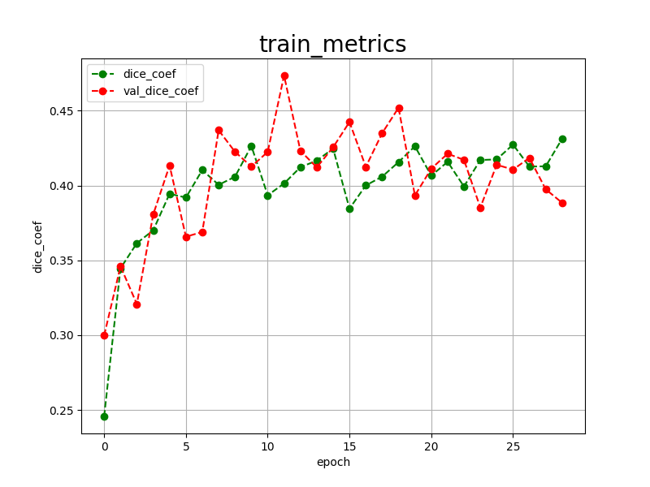

<h2>Tensorflow-Image-Segmentation-Augmented-DeepCell (2024/11/28)</h2>

This is the first experiment of Image Segmentation for DeepCell
 based on 
the latest <a href="https://github.com/sarah-antillia/Tensorflow-Image-Segmentation-API">Tensorflow-Image-Segmentation-API</a>, and
 <a href="https://drive.google.com/file/d/1tK_pDeOyTY0PUoWbYGJs1l0vDYQ1OrZg/view?usp=sharing">
DeepCell-ImageMask-Dataset.zip</a>, which was derived by us from  DynamicNuclearNet-segmentation-v1_0 dataset of
<a href="https://deepcell.readthedocs.io/en/master/data-gallery/dynamicnuclearnet.html">
DynamicNuclearNet</a>
 
 
<b>Data Augmentation Strategy:</b> 
 To address the limited size of DeepCell-ImageMask-Dataset, 
 we employed <a href="./src/ImageMaskAugmentor.py">an online augmentation tool</a> to enhance segmentation accuracy, which supports the following aumentation methods.
<li>Vertical flip</li>
<li>Horizontal flip</li>
<li>Rotation</li>
<li>Shrinks</li>
<li>Shears</li> 
<li>Deformation</li>
<li>Distortion</li>
<li>Barrel distortion</li>
<li>Pincushion distortion</li>
 
Please see also the following tools  
<li><a href="https://github.com/sarah-antillia/Image-Deformation-Tool">Image-Deformation-Tool</a></li>
<li><a href="https://github.com/sarah-antillia/Image-Distortion-Tool">Image-Distortion-Tool</a></li>
<li><a href="https://github.com/sarah-antillia/Barrel-Image-Distortion-Tool">Barrel-Image-Distortion-Tool</a></li>

 

<b>Actual Image Segmentation for Images of 512x512 pixels</b> 
As shown below, the inferred masks look similar to the ground truth masks.  

<table>
<tr>
<th>Input: image</th>
<th>Mask (ground_truth)</th>
<th>Prediction: inferred_mask</th>
</tr>
<tr>
<td></td>
<td></td>
<td></td>
</tr>

<tr>
<td></td>
<td></td>
<td></td>
</tr>

<tr>
<td></td>
<td></td>
<td></td>
</tr>
</table>

 
In this experiment, we used the simple UNet Model 
<a href="./src/TensorflowUNet.py">TensorflowSlightlyFlexibleUNet</a> for this DeepCellSegmentation Model. 
As shown in <a href="https://github.com/sarah-antillia/Tensorflow-Image-Segmentation-API">Tensorflow-Image-Segmentation-API</a>.
you may try other Tensorflow UNet Models: 

<li><a href="./src/TensorflowSwinUNet.py">TensorflowSwinUNet.py</a></li>
<li><a href="./src/TensorflowMultiResUNet.py">TensorflowMultiResUNet.py</a></li>
<li><a href="./src/TensorflowAttentionUNet.py">TensorflowAttentionUNet.py</a></li>
<li><a href="./src/TensorflowEfficientUNet.py">TensorflowEfficientUNet.py</a></li>
<li><a href="./src/TensorflowUNet3Plus.py">TensorflowUNet3Plus.py</a></li>
<li><a href="./src/TensorflowDeepLabV3Plus.py">TensorflowDeepLabV3Plus.py</a></li>

 

<h3>1. Dataset Citation</h3>
The dataset used here has been taken from Segmentation dataset of 
<a href="https://deepcell.readthedocs.io/en/master/data-gallery/dynamicnuclearnet.html">
DynamicNuclearNet 
</a>
 
<b>DynamicNuclearNet</b> 
DynamicNuclearNet is a training dataset for nuclear segmentation and tracking published in Schwartz et al. 2023. 
The dataset is made up of two subsets, one for tracking and one for segmentation.
 
 
<b>License</b> 
This dataset is licensed under a modified Apache license for non-commercial academic use only
 
 
© Copyright 2016-2024,M Van Valen Lab at the California Institute of Technology (Caltech). Revision f1839a4e. 

 
<h3>
<a id="2">
2 DeepCell ImageMask Dataset
</a>
</h3>
 If you would like to train this DeepCell Segmentation model by yourself,
 please download the dataset from the google drive  
<a href="https://drive.google.com/file/d/1tK_pDeOyTY0PUoWbYGJs1l0vDYQ1OrZg/view?usp=sharing">
DeepCell-ImageMask-Dataset.zip</a>, expand the downloaded ImageMaskDataset and put it under <b>./dataset</b> folder to be
<pre>
./dataset
└─DeepCell
    ├─test
    │   ├─images
    │   └─masks
    ├─train
    │   ├─images
    │   └─masks
    └─valid
        ├─images
        └─masks
</pre>
This is a subset derived from the train.npz dataset of the original one. 
   
<b>DeepCell Statistics</b> 
 
 
As shown above, the number of images of train and valid datasets is enough to use for a training set of our segmentation model.
However, some preliminary experiments suggested that an online dataset augmentation was required to train this DeepCell model.
Therefore, we enabled the online augmentation tool in the training process. 
 
 
<b>Train_images_Ssample</b> 

 
<b>Train_masks_sample</b> 

 

<h3>
3 Train TensorflowUNet Model
</h3>
 We have trained DeepCellTensorflowUNet Model by using the following
<a href="./projects/TensorflowSlightlyFlexibleUNet/DeepCell/train_eval_infer.config"> <b>train_eval_infer.config</b></a> file.  
Please move to ./projects/TensorflowSlightlyFlexibleUNet/DeepCelland run the following bat file. 
<pre>
>1.train.bat
</pre>
, which simply runs the following command. 
<pre>
>python ../../../src/TensorflowUNetTrainer.py ./train_eval_infer.config
</pre>

<b>Model parameters</b> 
Defined a small <b>base_filters</b> and large <b>base_kernels</b> for the first Conv Layer of Encoder Block of 
<a href="./src/TensorflowUNet.py">TensorflowUNet.py</a> 
and a large num_layers (including a bridge between Encoder and Decoder Blocks).
<pre>
[model]
base_filters   = 16
base_kernels   = (9,9)
num_layers     = 8
dilation       = (3,3)
</pre>

<b>Learning rate</b> 
Defined a small learning rate.  
<pre>
[model]
learning_rate  = 0.0001
</pre>

<b>Online augmentation</b> 
Enabled our online augmentation.  
<pre>
[model]
model         = "TensorflowUNet"
generator     = True
</pre>

<b>Loss and metrics functions</b> 
Specified "bce_dice_loss" and "dice_coef". 
<pre>
[model]
loss           = "bce_dice_loss"
metrics        = ["dice_coef"]
</pre>
<b>Learning rate reducer callback</b> 
Enabled learing_rate_reducer callback, and a small reducer_patience.
<pre> 
[train]
learning_rate_reducer = True
reducer_factor     = 0.3
reducer_patience   = 3
</pre>

<b>Early stopping callback</b> 
Enabled early stopping callback with patience parameter.
<pre>
[train]
patience      = 10
</pre>

<b>Epoch change inference callbacks</b> 
Enabled epoch_change_infer callback. 
<pre>
[train]
epoch_change_infer       = True
epoch_change_infer_dir   =  "./epoch_change_infer"
epoch_changeinfer        = False
epoch_changeinfer_dir    = "./epoch_changeinfer"
num_infer_images         = 6
</pre>

By using this callback, on every epoch_change, the inference procedure can be called
 for 6 images in <b>mini_test</b> folder. This will help you confirm how the predicted mask changes 
 at each epoch during your training process.    

<b>Epoch_change_inference output</b> 
 
 

In this experiment, the training process was stopped at epoch 29  by EarlyStopping Callback.  
 
 

<a href="./projects/TensorflowSlightlyFlexibleUNet/DeepCell/eval/train_metrics.csv">train_metrics.csv</a> 
 

 
<a href="./projects/TensorflowSlightlyFlexibleUNet/DeepCell/eval/train_losses.csv">train_losses.csv</a> 
 

 

<h3>
4 Evaluation
</h3>
Please move to a <b>./projects/TensorflowSlightlyFlexibleUNet/DeepCell</b> folder, 
and run the following bat file to evaluate TensorflowUNet model for DeepCell. 
<pre>
./2.evaluate.bat
</pre>
This bat file simply runs the following command.
<pre>
python ../../../src/TensorflowUNetEvaluator.py ./train_eval_infer_aug.config
</pre>

Evaluation console output: 

  Image-Segmentation-DeepCell

<a href="./projects/TensorflowSlightlyFlexibleUNet/DeepCell/evaluation.csv">evaluation.csv</a> 
The evaluation results, loss (bce_dice_loss) and dice_coef to this DeepCell/test were poor as shown below. 
<pre>
loss,0.5115
dice_coef,0.3971
</pre>
 

<h3>
5 Inference
</h3>
Please move to a <b>./projects/TensorflowSlightlyFlexibleUNet/DeepCell</b> folder 
,and run the following bat file to infer segmentation regions for images by the Trained-TensorflowUNet model for DeepCell. 
<pre>
./3.infer.bat
</pre>
This simply runs the following command.
<pre>
python ../../../src/TensorflowUNetInferencer.py ./train_eval_infer_aug.config
</pre>

<b>mini_test_images</b> 
 
<b>mini_test_mask(ground_truth)</b> 
 

<b>Inferred test masks</b> 
 
 

<b>Enlarged images and masks </b> 

<table>
<tr>
<th>Image</th>
<th>Mask (ground_truth)</th>
<th>Inferred-mask</th>
</tr>

<tr>
<td></td>
<td></td>
<td></td>
</tr>

<tr>
<td></td>
<td></td>
<td></td>
</tr>

<tr>
<td></td>
<td></td>
<td></td>
</tr>
<tr>
<td></td>
<td></td>
<td></td>
</tr>
<tr>
<td></td>
<td></td>
<td></td>
</tr>
<tr>
<td></td>
<td></td>
<td></td>
</tr>
</table>

 

<h3>
References
</h3>
<b>1, DynamicNuclearNet</b>  
<a href="https://deepcell.readthedocs.io/en/master/data-gallery/dynamicnuclearnet.html">
https://deepcell.readthedocs.io/en/master/data-gallery/dynamicnuclearnet.html	
</a>